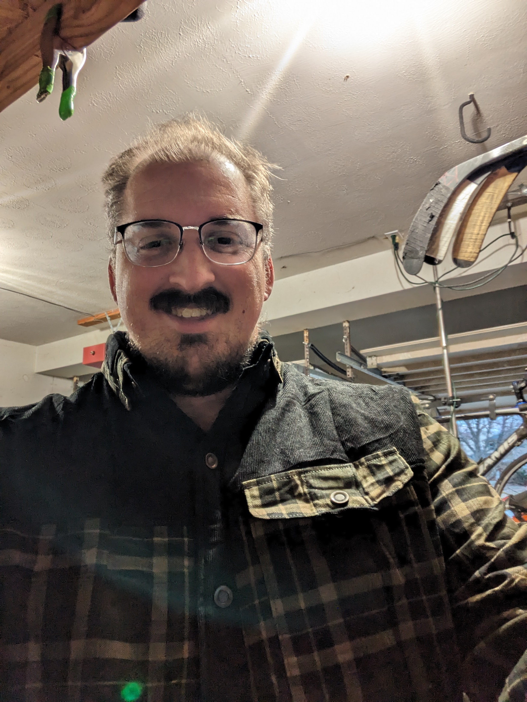
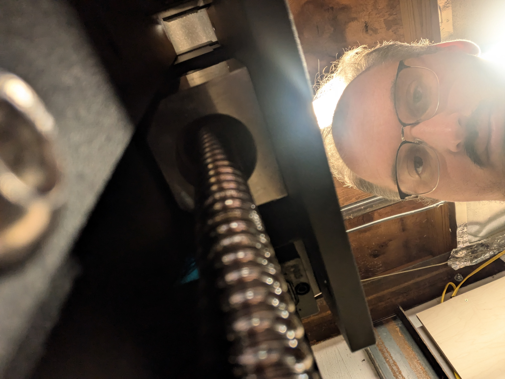

```{=html}
<style>
  @import url('https://fonts.googleapis.com/css2?family=Playfair+Display:ital,wght@0,400;0,600;1,400&family=Lato:wght@300;400;700&display=swap');

  :root {
    --mww-brown:  #5C3D2E;
    --mww-tan:    #C8A87A;
    --mww-green:  #3B5249;
    --mww-cream:  #F7F2EA;
    --mww-dark:   #1E1309;
  }

  body { background: var(--mww-cream); }
  #quarto-content { padding: 0 !important; }
  .page-layout-full main { padding: 0 !important; }

  /* ══════════════════════════════════════
     PAGE HEADER
  ══════════════════════════════════════ */
  .about-header {
    background: var(--mww-dark);
    padding: 4rem 2rem 3.5rem;
    text-align: center;
  }
  .about-header h1 {
    font-family: 'Playfair Display', Georgia, serif;
    font-weight: 400;
    font-size: clamp(2rem, 5vw, 3rem);
    color: var(--mww-tan);
    margin: 0 0 0.5rem;
  }
  .about-header p {
    font-family: 'Lato', sans-serif;
    font-weight: 300;
    font-size: 1rem;
    letter-spacing: 0.18em;
    text-transform: uppercase;
    color: rgba(247,242,234,0.6);
    margin: 0;
  }

  /* ══════════════════════════════════════
     INTRO — PORTRAIT + TEXT SIDE BY SIDE
  ══════════════════════════════════════ */
  .about-intro {
    background: var(--mww-cream);
    padding: 5rem 2rem;
  }
  .about-intro-inner {
    max-width: 960px;
    margin: 0 auto;
    display: grid;
    grid-template-columns: 340px 1fr;
    gap: 4rem;
    align-items: center;
  }
  @media (max-width: 720px) {
    .about-intro-inner {
      grid-template-columns: 1fr;
      gap: 2.5rem;
    }
  }
  .about-portrait {
    width: 100%;
    aspect-ratio: 3/4;
    object-fit: cover;
    object-position: center top;
    border-radius: 4px;
    box-shadow: 8px 8px 0px var(--mww-tan);
  }
  .about-intro-text h2 {
    font-family: 'Playfair Display', Georgia, serif;
    font-weight: 400;
    font-size: clamp(1.5rem, 3vw, 2rem);
    color: var(--mww-brown);
    margin: 0 0 1.25rem;
  }
  .about-intro-text p {
    font-family: 'Lato', sans-serif;
    font-weight: 300;
    font-size: 1.05rem;
    line-height: 1.85;
    color: #3a2a1e;
    margin-bottom: 1rem;
  }

  /* ══════════════════════════════════════
     SOURCING SECTION — DARK BAND
  ══════════════════════════════════════ */
  .about-sourcing {
    background: var(--mww-dark);
    padding: 5rem 2rem;
  }
  .about-sourcing-inner {
    max-width: 960px;
    margin: 0 auto;
    display: grid;
    grid-template-columns: 1fr 380px;
    gap: 4rem;
    align-items: center;
  }
  @media (max-width: 720px) {
    .about-sourcing-inner {
      grid-template-columns: 1fr;
      gap: 2.5rem;
    }
    .about-sourcing-img { order: -1; }
  }
  .about-sourcing-text h2 {
    font-family: 'Playfair Display', Georgia, serif;
    font-weight: 400;
    font-size: clamp(1.4rem, 3vw, 1.9rem);
    color: var(--mww-tan);
    margin: 0 0 1.25rem;
  }
  .about-sourcing-text p {
    font-family: 'Lato', sans-serif;
    font-weight: 300;
    font-size: 1.05rem;
    line-height: 1.85;
    color: rgba(247,242,234,0.85);
    margin-bottom: 1rem;
  }
  .about-sourcing-img {
    width: 100%;
    aspect-ratio: 3/4;
    object-fit: cover;
    object-position: center 20%;
    border-radius: 4px;
    box-shadow: -8px 8px 0px var(--mww-green);
    filter: grayscale(20%);
  }

  /* ══════════════════════════════════════
     CUSTOM ORDERS CTA
  ══════════════════════════════════════ */
  .about-cta {
    background: var(--mww-green);
    padding: 3.5rem 2rem;
    text-align: center;
  }
  .about-cta-inner {
    max-width: 560px;
    margin: 0 auto;
  }
  .about-cta p {
    font-family: 'Playfair Display', Georgia, serif;
    font-style: italic;
    font-size: clamp(1.1rem, 2.5vw, 1.4rem);
    color: #fff;
    line-height: 1.7;
    margin-bottom: 1.75rem;
  }
  .mww-btn {
    font-family: 'Lato', sans-serif;
    font-weight: 700;
    font-size: 0.85rem;
    letter-spacing: 0.12em;
    text-transform: uppercase;
    padding: 0.75rem 2rem;
    border-radius: 2px;
    text-decoration: none;
    transition: all 0.2s ease;
    display: inline-block;
  }
</style>

<!-- ══ PAGE HEADER ══ -->
<section class="about-header">
  <h1>About the Shop</h1>
  <p>Handcrafted in Ohio &nbsp;·&nbsp; One maker, one piece at a time</p>
</section>

<!-- ══ INTRO ══ -->
<section class="about-intro">
  <div class="about-intro-inner">
    
    <div class="about-intro-text">
      <h2>Hi, I'm Andrew.</h2>
      <p>
        I grew up in my dad's basement shop — a modest setup with a Delta table saw, a band saw,
        and just enough tools to fix anything that broke. We weren't making art. We were making
        things work. But somewhere along the way, I realized that functional and beautiful didn't
        have to be mutually exclusive.
      </p>
      <p>
        I'm not a natural artist. I can't draw. I never could. But I discovered that wood gave me
        a creative outlet I didn't know I needed. The grain, the figure, the character that comes
        out when you run a slab through the planer for the first time — it stopped feeling like a
        project and started feeling like a conversation with the material.
      </p>
      <p>
        These days, woodworking is as close to meditation as I get. Every piece gets my full
        attention from the first cut to the final coat of finish. I combine hand techniques with
        a CNC machine for joinery and detail work that would otherwise take weeks to do by hand —
        but the eye, the judgment, and the sanding block at the end? That's always me.
      </p>
    </div>
  </div>
</section>

<!-- ══ SOURCING ══ -->
<section class="about-sourcing">
  <div class="about-sourcing-inner">
    <div class="about-sourcing-text">
      <h2>Wood that means something.</h2>
      <p>
        As a lifelong environmentalist, I can't separate what I make from where the material
        comes from. I source nearly all of my hardwood from small local mills and individual
        craftspeople in the greater Cincinnati area — people who share a commitment to responsible
        land stewardship.
      </p>
      <p>
        These aren't plantation trees. Most of the wood I work with comes from old trees that
        needed to come down — storm damage, disease, land clearing done right. Trees that would
        otherwise be chipped or left to rot are instead kiln-dried and given a second life as
        something that will last another hundred years in someone's home.
      </p>
      <p>
        I'll occasionally source an exotic hardwood for a special piece, but even then I'm
        deliberate about it. The default is always local, always small, always traceable.
      </p>
    </div>
    
  </div>
</section>

<!-- ══ CTA ══ -->
<section class="about-cta">
  <div class="about-cta-inner">
    <p>
      Have something specific in mind? Custom orders are my favorite kind of work —
      bring me a challenge and let's figure it out together.
    </p>
    <a href="contact.html" class="mww-btn" style="background: var(--mww-tan); color: var(--mww-dark); border: 2px solid var(--mww-tan);">Get in Touch</a>
  </div>
</section>
```
