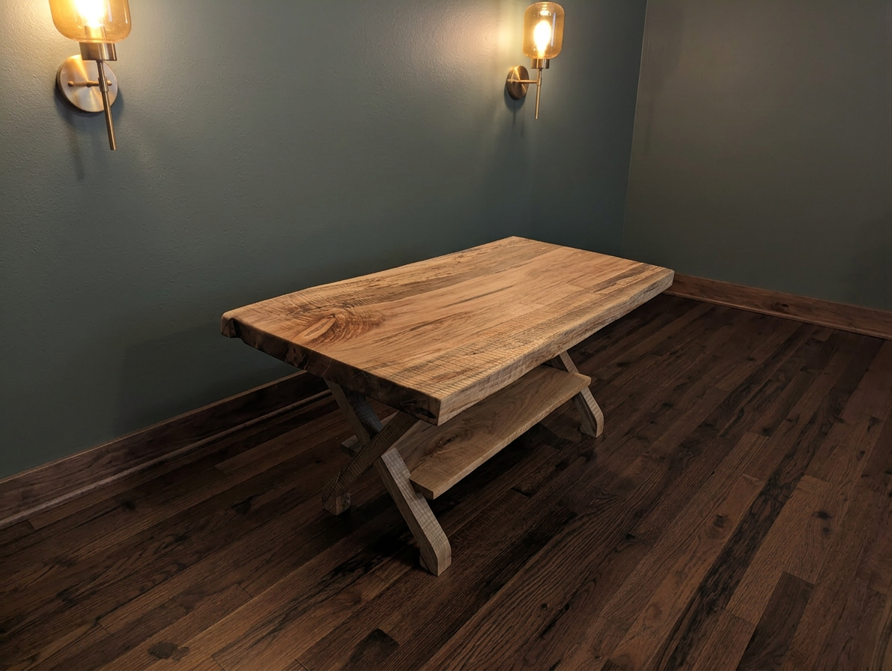

```{=html}
<style>
  /* ── Fonts ── */
  @import url('https://fonts.googleapis.com/css2?family=Playfair+Display:ital,wght@0,400;0,600;1,400&family=Lato:wght@300;400;700&display=swap');

  /* ── Tokens ── */
  :root {
    --mww-brown:  #5C3D2E;
    --mww-tan:    #C8A87A;
    --mww-green:  #3B5249;
    --mww-cream:  #F7F2EA;
    --mww-dark:   #1E1309;
  }

  /* ── Reset page chrome ── */
  body { background: var(--mww-cream); }
  #quarto-content { padding: 0 !important; }
  .page-layout-full main { padding: 0 !important; }

  /* ══════════════════════════════════════
     HERO
  ══════════════════════════════════════ */
  .mww-hero {
    position: relative;
    width: 100%;
    max-height: 90vh;
    overflow: hidden;
  }
  .mww-hero img {
    width: 100%;
    height: 90vh;
    object-fit: cover;
    object-position: center 30%;
    display: block;
  }
  .mww-hero-overlay {
    position: absolute;
    inset: 0;
    background: linear-gradient(
      to bottom,
      rgba(30,19,9,0.15) 0%,
      rgba(30,19,9,0.55) 100%
    );
    display: flex;
    flex-direction: column;
    align-items: center;
    justify-content: flex-end;
    padding-bottom: 4rem;
    text-align: center;
  }
  .mww-hero-tagline {
    font-family: 'Playfair Display', Georgia, serif;
    font-style: italic;
    font-size: clamp(1.5rem, 4vw, 2.75rem);
    color: #fff;
    letter-spacing: 0.01em;
    margin-bottom: 0.5rem;
    text-shadow: 0 2px 12px rgba(0,0,0,0.4);
  }
  .mww-hero-sub {
    font-family: 'Lato', sans-serif;
    font-weight: 300;
    font-size: clamp(0.85rem, 1.8vw, 1.1rem);
    color: rgba(255,255,255,0.85);
    letter-spacing: 0.18em;
    text-transform: uppercase;
    margin-bottom: 2rem;
  }
  .mww-hero-ctas {
    display: flex;
    gap: 1rem;
    flex-wrap: wrap;
    justify-content: center;
  }
  .mww-btn {
    font-family: 'Lato', sans-serif;
    font-weight: 700;
    font-size: 0.85rem;
    letter-spacing: 0.12em;
    text-transform: uppercase;
    padding: 0.75rem 2rem;
    border-radius: 2px;
    text-decoration: none;
    transition: all 0.2s ease;
  }
  .mww-btn-primary {
    background: var(--mww-tan);
    color: var(--mww-dark);
    border: 2px solid var(--mww-tan);
  }
  .mww-btn-primary:hover {
    background: transparent;
    color: var(--mww-tan);
    text-decoration: none;
  }
  .mww-btn-outline {
    background: transparent;
    color: #fff;
    border: 2px solid rgba(255,255,255,0.7);
  }
  .mww-btn-outline:hover {
    background: rgba(255,255,255,0.15);
    color: #fff;
    text-decoration: none;
  }

  /* ══════════════════════════════════════
     ABOUT STRIP
  ══════════════════════════════════════ */
  .mww-about {
    background: var(--mww-dark);
    color: var(--mww-cream);
    padding: 4rem 2rem;
    text-align: center;
  }
  .mww-about-inner {
    max-width: 700px;
    margin: 0 auto;
  }
  .mww-about h2 {
    font-family: 'Playfair Display', Georgia, serif;
    font-size: clamp(1.4rem, 3vw, 2rem);
    color: var(--mww-tan);
    margin-bottom: 1.25rem;
    font-weight: 400;
  }
  .mww-about p {
    font-family: 'Lato', sans-serif;
    font-weight: 300;
    font-size: 1.05rem;
    line-height: 1.85;
    color: rgba(247,242,234,0.88);
    margin-bottom: 1rem;
  }

  /* ══════════════════════════════════════
     GIFT CALLOUT
  ══════════════════════════════════════ */
  .mww-gift {
    background: var(--mww-green);
    padding: 3.5rem 2rem;
    text-align: center;
  }
  .mww-gift-inner {
    max-width: 600px;
    margin: 0 auto;
  }
  .mww-gift p {
    font-family: 'Playfair Display', Georgia, serif;
    font-style: italic;
    font-size: clamp(1.15rem, 2.5vw, 1.5rem);
    color: #fff;
    line-height: 1.7;
    margin-bottom: 1.75rem;
  }

  /* ══════════════════════════════════════
     TRUST FOOTER STRIP
  ══════════════════════════════════════ */
  .mww-trust {
    background: var(--mww-cream);
    border-top: 1px solid rgba(92,61,46,0.15);
    padding: 2rem 1rem;
    text-align: center;
  }
  .mww-trust-pills {
    display: flex;
    gap: 2rem;
    justify-content: center;
    flex-wrap: wrap;
  }
  .mww-trust-pill {
    font-family: 'Lato', sans-serif;
    font-size: 0.8rem;
    font-weight: 700;
    letter-spacing: 0.15em;
    text-transform: uppercase;
    color: var(--mww-brown);
    display: flex;
    align-items: center;
    gap: 0.5rem;
  }
  .mww-trust-pill::before {
    content: '—';
    color: var(--mww-tan);
  }
</style>

<!-- ══ HERO ══ -->
<section class="mww-hero">
  
  <div class="mww-hero-overlay">
    <p class="mww-hero-tagline">Form, function, and a little bit of soul.</p>
    <p class="mww-hero-sub">Handcrafted in Ohio &nbsp;·&nbsp; Locally sourced hardwood</p>
    <div class="mww-hero-ctas">
      <a href="shop.html" class="mww-btn mww-btn-primary">Shop Now</a>
      <a href="gallery.html" class="mww-btn mww-btn-outline">See the Work</a>
    </div>
  </div>
</section>

<!-- ══ ABOUT STRIP ══ -->
<section class="mww-about">
  <div class="mww-about-inner">
    <h2>Built by hand. Meant to last.</h2>
    <p>
      I grew up in my dad's basement shop, learning to fix things long before I ever thought about making them beautiful.
      Somewhere along the way, woodworking stopped being just functional and became something closer to meditation —
      a way to create something lasting with my hands.
    </p>
    <p>
      Every piece starts with solid hardwood locally sourced. As a lifelong environmentalist, its important to me to responsibly source this wood from local mills and arborists who believe in sustainable practices. My goal is to give this wood a second life that is functional, long-lasting and crafted with extreme care. I combine traditional hand techniques with modern methods to create detailed pieces that my customers will appreciate.
    </p>
    <p>
      The goal is always the same: something beautiful, built to last, at a price that's fair.
    </p>
    <br>
    <a href="about.html" class="mww-btn mww-btn-primary" style="border-color: var(--mww-tan); color: var(--mww-dark);">More About the Shop</a>
  </div>
</section>

<!-- ══ GIFT CALLOUT ══ -->
<section class="mww-gift">
  <div class="mww-gift-inner">
    <p>
      "Looking for a gift that stops someone in their tracks?
      Something they weren't expecting — but will immediately love and keep forever?"
    </p>
    <a href="shop.html" class="mww-btn" style="background: var(--mww-tan); color: var(--mww-dark); border: 2px solid var(--mww-tan);">Find the Perfect Gift</a>
  </div>
</section>

<!-- ══ TRUST STRIP ══ -->
<section class="mww-trust">
  <div class="mww-trust-pills">
    <span class="mww-trust-pill">Sourced Locally</span>
    <span class="mww-trust-pill">Built in Ohio</span>
    <span class="mww-trust-pill">Finished by Hand</span>
    <span class="mww-trust-pill">Custom Orders Welcome</span>
  </div>
</section>
```
